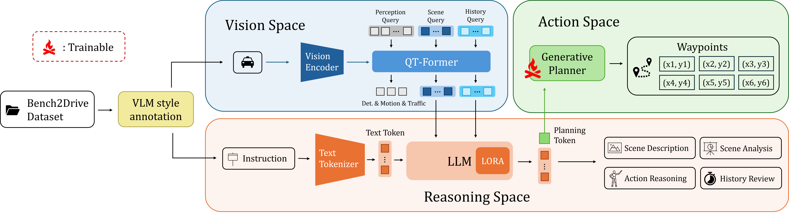

# Bench2Drive-Style

NYCU CS Project | 2025.09-Present \
From NYCU ACM Lab | 李尹瑄、曾歆喬、黃襄香

## Introduction
- We curated Bench2Drive-Style,  which extends the Bench2Drive Dataset with 3 driving-style labels (**aggressive / normal / conservative**) by developing a VLM based style annotation pipeline and verify the credibility with the StyleDrive dataset.
- Then we trained StyleOrion by modifying the generative planner from ORION using conditional VAE to learn stylish driving policy from our Bench2Drive-Style.
<p align="center">
  
</p>
- Style-aware evaluation on the CARLA simulator would be further explored in the future.

## Repository structure

```
├── style_labeling/
│   ├── prompts/              system_prompt.txt, classification_prompt.txt
│   ├── common/               vLLM engine and request, answer parsing, default paths
│   ├── bench2drive/
│   │   ├── infos/            build_infos.py (runs Bench2DriveZoo's prepare_B2D.py on the labeled scenes)
│   │   ├── prepare/          prepare_multiview.py, prepare_bev.py, prepare_ego_context.py
│   │   ├── inference/        run_vlm.py
│   │   ├── labels/           parse_results.py, build_style_pkl.py
│   │   └── splits/           labeled_scenes.json (the 36 labeled scenes)
│   └── styledrive/
│       ├── prepare/          prepare_multiview.py, prepare_bev.py, prepare_ego_context.py
│       ├── inference/        run_vlm.py
│       └── evaluation/       evaluate.py
├── StyleOrion/               ORION fork with a style-conditioned planner (changed files are
│                             marked with a [Bench2Drive-Style] banner)
├── scripts/                  download_bench2drive.sh, download_styledrive.sh,
│                             label_bench2drive.sh, eval_styledrive.sh, train_vae_style.sh
├── docs/                     see Documentation below
├── data/                     not tracked; see docs/DataPreparation.md
├── third_party/              not tracked; Bench2DriveZoo checkout
└── README.md                 this document!
```

## Setup

Two environments are needed:

| Environment | Used for | Install |
|---|---|---|
| style_labeling | steps 1–3 | `pip install -r style_labeling/requirements.txt` (vLLM ≥ 0.20.2, plus opencv-python and pyquaternion for the infos). StyleDrive's `prepare_bev.py` also needs nuplan-devkit, installed as in the NAVSIM / StyleDrive setup |
| StyleOrion | step 4 | see [ORION environment](#orion-environment) below |

VLM inference uses 2 GPUs by default (tensor parallel). Fine-tuning uses 1 GPU, and the bf16 changes in `StyleOrion/` are meant to fit it on a 24 GB card.

### ORION environment

```bash
conda create -n orion python=3.8 -y
conda activate orion
pip install torch==2.4.1+cu118 torchvision==0.19.1+cu118 torchaudio==2.4.1 --index-url https://download.pytorch.org/whl/cu118
cd StyleOrion
pip install -v -e .
pip install -r requirements.txt
```

Install torch first: `requirements.txt` pins `torch==2.4.1+cu118`, which pip only finds on the PyTorch index. `requirements.txt` also pins `flash-attn==0.2.8`. `mmcv/models/utils/attention.py` imports the flash-attn v1 function `flash_attn_unpadded_kvpacked_func`. With flash-attn 2.x, swap the two import lines there, as its comment explains. The checkpoints this step needs are listed under [Step 4. Policy fine-tuning](#step-4-policy-fine-tuning).


## Step 1. Data preparation

Nothing under `data/` is tracked. Details, and how to use another scene list or location, are in [docs/DataPreparation.md](docs/DataPreparation.md).

**Bench2Drive.** Only the 36 labeled scenes are needed.

```bash
pip install -U huggingface_hub                   # provides the `hf` command
bash scripts/download_bench2drive.sh             # 36 scenes (~11 GB) + HD maps of their 7 towns (~3.5 GB)

git clone -b uniad/vad https://github.com/Thinklab-SJTU/Bench2DriveZoo.git third_party/Bench2DriveZoo
python -m style_labeling.bench2drive.infos.build_infos --workers 16
```

`build_infos` runs Bench2DriveZoo's `prepare_B2D.py` unmodified on the labeled scenes. That file is licensed CC BY-NC-ND 4.0, so it is not included here. It writes `data/Bench2Drive/infos/b2d_infos_train.pkl` (8384 frames) and `b2d_map_infos.pkl`.

**StyleDrive.** Only the test split (4049 clips) is used.

```bash
bash scripts/download_styledrive.sh   # ~130 GB, mostly camera images; re-run to resume
```

It downloads the ground truth (`styletest.json`), the test scene filter (`styletest.yaml`), the OpenScene v1.1 test metadata and camera images, and the nuPlan maps into `data/StyleDrive/`.

## Step 2. Labeling Bench2Drive

```bash
bash scripts/label_bench2drive.sh     # RUN_TAG=<name> to name the run; CUDA_VISIBLE_DEVICES defaults to 0,1
```

The script runs these stages. Each can also be run on its own (`python -m style_labeling.bench2drive.<stage>.<script> --help`):

| Stage | Output |
|---|---|
| `prepare.prepare_multiview`, `prepare.prepare_bev`, `prepare.prepare_ego_context` | VLM inputs in `data/Bench2Drive/StyleClips/` |
| `inference.run_vlm --run-tag <tag>` | `data/Bench2Drive/StyleResults/<tag>/<scene>/check_response.json`, one VLM answer per clip |
| `labels.parse_results` | `parsed_reasons_vllm.json` per scene, plus plots |
| `labels.build_style_pkl --sigma 4` | `data/Bench2Drive/infos/b2d_infos_train_with_style.pkl`: `b2d_infos_train.pkl` plus a `driving_style` float per frame (`0.0` where there is no label) |

By default inference uses 2 GPUs with tensor parallelism and a 65536-token context (`--tp 2 --max-model-len 65536`), the settings used for the results above. `run_vlm.py` resumes where it stopped: pass the same `--run-tag` again.

## Step 3. Validation on StyleDrive

```bash
bash scripts/eval_styledrive.sh
```

It builds the same three kinds of VLM input for the 4049 test clips, runs the labeler with the same prompt, and compares its labels with StyleDrive's ground truth. `data/StyleDrive/StyleResults/<run-tag>/` then holds:

- `comparison_report.txt`: confusion matrix, per-class precision / recall / F1, accuracy, macro F1, and accuracy by scenario type and speed mode;
- `confusion_matrix.png`, `label_distribution.png`;
- `parsed_reasons_vllm.json`: the parsed answer for every clip.

## Step 4. Policy fine-tuning

Before the first run, put the checkpoints under `StyleOrion/ckpts/`:

| Path | Source |
|---|---|
| `pretrain_qformer/` | [exiawsh/pretrain_qformer](https://huggingface.co/exiawsh/pretrain_qformer/) |
| `Orion.pth` | the official ORION checkpoint |

Then, in the ORION environment:

```bash
bash scripts/train_vae_style.sh
RESUME_FROM=StyleOrion/adzoo/orion/work_dirs/orion_stage2_vae_style_ft/iter_4000.pth \
    bash scripts/train_vae_style.sh                     # resume a stopped run
```

The script fine-tunes ORION's VAE planner on `b2d_infos_train_with_style.pkl` with config `StyleOrion/adzoo/orion/configs/orion_stage2_vae_style_ft.py`:

- only the planner and the style projection are trained. The vision backbone, the detection and map heads and the LLM are frozen;
- one GPU in bf16. The 7.5 B-parameter model does not fit on a 24 GB card in fp32, and several ops were changed to run in bf16 (listed in [docs/TrainingVAEStyle.md §5](docs/TrainingVAEStyle.md#5-precision-changes));
- it starts from `Orion.pth` and saves a checkpoint every 2000 iterations. `MAX_ITERS` (default 20896), `WORK_DIR`, `LOAD_FROM`, `RESUME_FROM` and `CUDA_VISIBLE_DEVICES` are set through environment variables. With one GPU and batch size 1, one iteration is one frame.

To check that the style actually changes the plan, run the model offline with the style forced to −1, 0 and +1 (`FORCE_DRIVING_STYLE`) and compare the trajectories. `STYLE_GUIDANCE` > 1 strengthens the effect. See [docs/TrainingVAEStyle.md §6](docs/TrainingVAEStyle.md#6-checking-that-the-style-changes-the-plan).


## TL;DR
All commands run from the repo root.

```bash
# 1. data preparation
bash scripts/download_bench2drive.sh
python -m style_labeling.bench2drive.infos.build_infos --workers 16
bash scripts/download_styledrive.sh

# 2. labeling: Bench2Drive → data/Bench2Drive/infos/b2d_infos_train_with_style.pkl
bash scripts/label_bench2drive.sh

# 3. validation: StyleDrive → data/StyleDrive/StyleResults/<run-tag>/comparison_report.txt
bash scripts/eval_styledrive.sh

# 4. policy fine-tuning (ORION environment): → StyleOrion/adzoo/orion/work_dirs/orion_stage2_vae_style_ft/
bash scripts/train_vae_style.sh
```

## Documentation

| Document | Contents |
|---|---|
| [docs/DataPreparation.md](docs/DataPreparation.md) | downloads, infos pkls, data layout |
| [docs/TrainingVAEStyle.md](docs/TrainingVAEStyle.md) | VAE fine-tune: prerequisites, script options, config, bf16 precision changes, checking the style effect |


## Acknowledgements

This project builds on [ORION](https://github.com/xiaomi-mlab/Orion), [Bench2Drive](https://github.com/Thinklab-SJTU/Bench2Drive), [StyleDrive](https://github.com/AIR-THU/StyleDrive), [NAVSIM](https://github.com/autonomousvision/navsim), [nuPlan](https://github.com/motional/nuplan-devkit), [Qwen3-VL](https://github.com/QwenLM/Qwen3-VL) and [vLLM](https://github.com/vllm-project/vllm).
